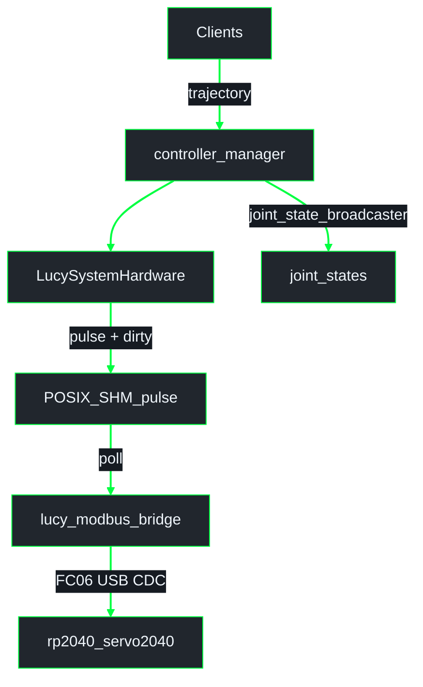

# ros2_control on Lucy (`lucy_ros_packages` + robot URDF)

ROS 2 **Jazzy**. Hardware plugin, SHM/Modbus path (current), WIP f64 HI contract, YAML, and launch. URDF / xacro blocks live in the active robot package (`thais_urdf` / `inmoov_urdf` / `so_arm101_urdf`); plugin binary in **`lucy_ros2_control`**.

**Related:**
- Pipeline / SHM: [`architecture/pipeline_shm.md`](architecture/pipeline_shm.md)
- Firmware paths: [`../../lucy_embedded_firmware/docs/architecture/firmware.md`](../../lucy_embedded_firmware/docs/architecture/firmware.md)
- Workspace overview: [`../../lucy_control_panel/docs/architecture/overview.md`](../../lucy_control_panel/docs/architecture/overview.md)
- [`DEVELOPER.md`](DEVELOPER.md)

---

## 1. What is ros2_control ?

Layer between high-level motion and hardware (or sim): controller manager, controllers, broadcasters, and a hardware interface plugin (`read()` / `write()`).

Clients talk to **controllers**, not microcontrollers. On Lucy today, the plugin writes a **POSIX SHM register table**; a host bridge (`lucy_modbus_bridge` on the pipeline tip) relays dirty registers as **Modbus RTU** over USB CDC to RP2040 firmware. The MCU does **not** mmap host SHM.

---

## 2. Lucy: components and packages

| Asset | Package / tip | Notes |
|--------|---------------|--------|
| **`LucySystemHardware`** | `lucy_ros2_control` | SHM writer for real hardware. |
| **`lucy_modbus_bridge`** | on **`cma/pipeline-flash`** (and stacked tips) | Polls pulse dirty bits → Modbus FC06. May be absent on pure docs branches. |
| **`SharedMemoryChannel` / f64 `ActuatorSharedState`** | WIP [#63](https://github.com/Lucy-Robotics/lucy_ros_packages/pull/63) | Target HI layout — **not** the default on this docs PR. |
| **`firmwares/linux`** | firmware WIP `mbo/feat-protocol` | Host USB Feetech consumer of f64 SHM. |
| **`rp2040_servo2040`** | firmware `cma/fw-boards` | InMoov + SO-ARM101 UART Feetech / PWM / I2C. |
| Controllers YAML / xacro | robot package | From `lucy_config_generator` / pipeline. |

---

## 3. Data flow — current (Modbus pulse)

No micro-ROS; no `/actuators/*` command topics for actuation. Detail in [`architecture/pipeline_shm.md`](architecture/pipeline_shm.md).

- **`/joint_states`**: from **`joint_state_broadcaster`**.
- **SHM (current tip):** `cmd` + pulse at register indices; dirty bits; names like `/{node}.lucy_reg_table`.
- **SO-ARM101 / InMoov:** Servo2040 profiles behind that Modbus link (UART0 Feetech or PWM/I2C).
- **YAML:** angles in **radians** (degrees only at LCP UI).

### Target (WIP)

HI → `/{node_name}` f64 `ActuatorSharedState` → `firmwares/linux` (USB Feetech) and/or a future host↔MCU bridge into Servo2040. See pipeline doc §B. Do not treat as already shipping on this PR.

---

## 4. Hardware plugin behavior (`LucySystemHardware`)

| `use_gazebo_sim` | `use_mock_hardware` | Plugin | `publish_actuators` |
|------------------|---------------------|--------|---------------------|
| `false` | `false` | `lucy_ros2_control/LucySystemHardware` | `true` (optional debug topic) |
| `false` | `true`  | `lucy_ros2_control/LucySystemHardware` | `false` |
| `true`  | *any*   | `gz_ros2_control/GazeboSimSystem` | n/a |

- `node_name` must match the SHM consumer / bridge.
- Current `write()` path (pipeline tip): URDF clamp → joint→servo rad → pulse SHM + dirty bits.
- WIP f64 path (#63): write `hw_commands[]` as radians + bump `command_seq`.

> **Gazebo caveat.** Upstream `gz_ros2_control` (jazzy) may not apply `<command_interface>` min/max inside `write()`.

---

## 5. Launch entry points

| Launch | Notes |
|--------|-------|
| `ros2 launch lucy_bringup lucy.launch.py` | Web API + (on pipeline tip, `real:=true`) Modbus bridges + control |
| `ros2 launch <robot_package> control.launch.py` | Minimal control stack |
| Gazebo launches | Sim plugins |

On some docs-only tips, `_real_hardware_stack` may still be empty — use **`cma/pipeline-flash`** for real Modbus bringup.

---

## 6. Web control panel

Needs active controllers, `ros2_control_node` with `LucySystemHardware` (or Gazebo), and the selected SHM consumer (Modbus bridge today).

---

## 7. Operational pitfalls

1. Controllers inactive — `ros2 control list_controllers`.
2. Sim URDF on hardware — `use_gazebo_sim:=false`.
3. SHM / bridge `node_name` mismatch.
4. **Encoding today:** pulse in Modbus SHM; radians in YAML/HI. Do not mix tips.
5. Run GENERATE so URDF min/max land in xacro.
6. SO-ARM101: Servo2040 UART Feetech (current) vs future host `firmwares/linux` — pick matching tips.
7. Tip skew: rad YAML + `rp2040_servo2040` need matching generator/firmware branches.

---

## 8. File index

| Path | Purpose |
|------|---------|
| `lucy_ros2_control/src/lucy_system.cpp` | HI plugin |
| `lucy_ros2_control/src/include/shared_memory_channel.hpp` | f64 layout on **#63 tip only** |
| `lucy_modbus_bridge/` | Pulse SHM → Modbus (**pipeline tip**) |
| Generator templates | xacro / board YAML / controllers |
| `lucy_embedded_firmware/` | RP2040 (+ WIP host Feetech) |

---

## 9. Config pipeline

VALIDATE → GENERATE (always) → optional BUILD/FLASH → RELOAD. See [`architecture/pipeline_shm.md`](architecture/pipeline_shm.md).
