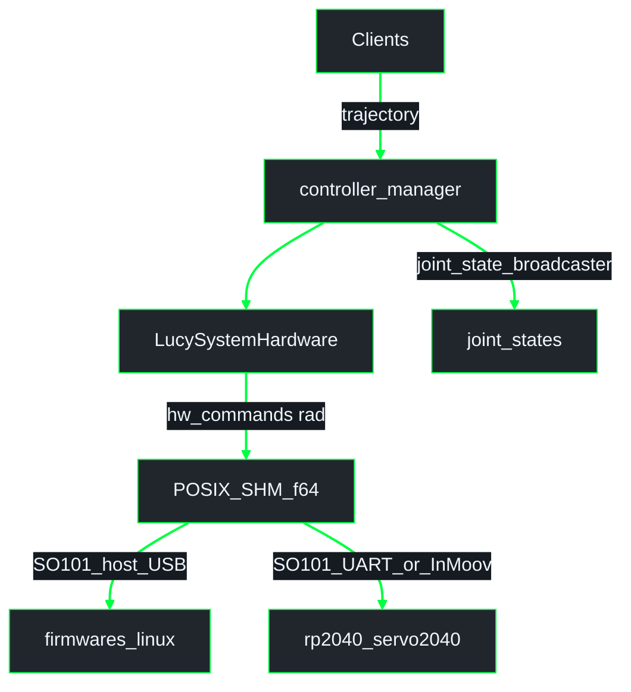

# ros2_control on Lucy (`lucy_ros_packages` + robot URDF)

ROS 2 **Jazzy**. This document explains **ros2_control**, and how it is implemented in Lucy: hardware plugin, SHM HI path, YAML, and launch files. URDF / xacro for `ros2_control` blocks live in the active robot package (e.g. **`thais_urdf`** / **`inmoov_urdf`** / **`so_arm101_urdf`**); plugin binary and shared helpers live in **`lucy_ros2_control`**.

**Related:**
- Architecture index: [`lucy_ws/docs/architecture/README.md`](../../../docs/architecture/README.md)
- System schematic: [`lucy_ws/docs/architecture/overview.md`](../../../docs/architecture/overview.md)
- Conventions: [`lucy_ws/docs/architecture/GUIDE.md`](../../../docs/architecture/GUIDE.md)
- Pipeline / SHM contract: [`architecture/pipeline_shm.md`](architecture/pipeline_shm.md)
- Firmware paths: [`../../lucy_embedded_firmware/docs/architecture/firmware.md`](../../lucy_embedded_firmware/docs/architecture/firmware.md)
- [`DEVELOPER.md`](DEVELOPER.md) (repo layout, CI); robot-package `docs/DEVELOPER.md` for URDF / sim launches

---

## 1. What is ros2_control ?

**ros2_control** is the layer between **high-level motion** (trajectories, teleop, UIs) and **hardware** (or sim). Typical components:

| Component | Role |
|--------|------|
| **Controller manager** | Loads controllers, runs update loop at `update_rate`. |
| **Controllers** | Consume commands / goals and write **command interfaces** (e.g. position) on hardware handles. |
| **Broadcasters** | Read **state interfaces** and publish ROS messages (e.g. **`joint_state_broadcaster`** → `/joint_states`). |
| **Hardware interface (plugin)** | Maps command/state buffers to real devices or sim (`read()` / `write()` each cycle). |

Clients (MoveIt, web panel, scripts) usually talk to **controllers** (e.g. `FollowJointTrajectory` on a `joint_trajectory_controller`), not directly to microcontrollers. On Lucy, the hardware plugin writes a **POSIX SHM joint table** (`f64` radians). Downstream consumers are robot-specific (host USB Feetech, Servo2040 UART Feetech, or Servo2040 PWM/I2C) — see [`architecture/pipeline_shm.md`](architecture/pipeline_shm.md).

---

## 2. Lucy: components and packages

| Asset | Package | Notes |
|--------|---------|--------|
| **`LucySystemHardware`** | `lucy_ros2_control` | `hardware_interface::SystemInterface` plugin; SHM for **real** hardware. Target layout: `ActuatorSharedState` / `JointTable` **f64 rad** ([#63](https://github.com/Lucy-Robotics/lucy_ros_packages/pull/63)). |
| **`SharedMemoryChannel`** | `lucy_ros2_control` (m-brl tip) | mmap helper for the f64 joint arrays. |
| **`lucy_modbus_bridge`** | `lucy_modbus_bridge` | **Transitional** — dirty-bit millirad registers → Modbus FC06. Retire when Servo2040 speaks HI f64 SHM. |
| **`firmwares/linux`** | `lucy_embedded_firmware` | SO-ARM101 host path: SHM → USB serial Feetech. |
| **`rp2040_servo2040`** | `lucy_embedded_firmware` | InMoov + SO-ARM101 UART Feetech / PWM / I2C. |
| **Controllers YAML** | robot package (`config/controllers.yaml`) | Generated by `lucy_config_generator` / pipeline. |
| **`control.launch.py`** | robot package | `robot_state_publisher` + `ros2_control_node` + spawners. |
| **`<ros2_control>` xacro** | robot package | One **system** block per board; plugin `LucySystemHardware` or `gz_ros2_control/GazeboSimSystem`. |

Joint names in generated **`controllers.yaml`** must match the URDF / xacro **exactly**.

---

## 3. Data flow (Lucy, real robot)

**UML Component (ros2_control actuation)** - clients through SHM f64 to firmware consumers.
There is **no micro-ROS** path and **no `/actuators/*` command topics** for
actuation. System-wide context is only in the
[workspace overview](../../../docs/architecture/overview.md); package detail is in
[`architecture/pipeline_shm.md`](architecture/pipeline_shm.md).

- **`/joint_states`**: fused state for **`robot_state_publisher`**, RViz, TF. Comes from **`joint_state_broadcaster`**, not from firmware CDC.
- **SHM (target)**: `LucySystemHardware::write()` publishes **radians as `double`/`f64`** into `hw_commands[]` (and related arrays) with seq counters. Config YAML angles are **radians** (degrees only at the LCP UI boundary).
- **SO-ARM101**: either host `firmwares/linux` (USB serial Feetech) **or** Servo2040 **UART0** Feetech (`bus_servo_only`).
- **InMoov**: Servo2040 PWM / I2C PCA9685 / ADC only.
- **Transitional**: tips that still encode millirad + dirty bits + `lucy_modbus_bridge` are temporary; do not treat as the long-term HI story.
- **Optional debug**: when `publish_actuators` is true, the HI may also publish a legacy `JointState` topic. Actuation does **not** depend on it.

---

## 4. Hardware plugin behavior (`LucySystemHardware`)

`LucySystemHardware` is the only ros2_control plugin Lucy ships. The same plugin is selected for **real** and **mock/RViz** hardware; only Gazebo uses a different plugin (`gz_ros2_control/GazeboSimSystem`).

| `use_gazebo_sim` | `use_mock_hardware` | Plugin selected | `publish_actuators` |
|------------------|---------------------|-----------------|---------------------|
| `false` | `false` | `lucy_ros2_control/LucySystemHardware` | `true` (optional JointState debug topic) |
| `false` | `true`  | `lucy_ros2_control/LucySystemHardware` | `false` |
| `true`  | *any*   | `gz_ros2_control/GazeboSimSystem` | n/a |

Per-board parameters (xacro, real hardware path):

- `node_name = lucy_hardware_interface_<suffix>` (SHM segment name; must match firmware / bridge consumer).
- `publisher_topic` - optional legacy/debug `JointState` topic when `publish_actuators` is true. **Actuation does not depend on this topic.**

Implementation direction (`lucy_ros2_control`):

- **`on_init()`** — validate joints, mappings, open SHM (`SharedMemoryChannel` / `ActuatorSharedState` on the f64 tip).
- **`read()`** — copy `hw_positions[]` (or mirror commands when no encoders).
- **`write()`** — URDF clamp → joint→servo rad mapping → write **`hw_commands[]` as radians** and bump `command_seq`.

Transitional tips may still call `init_registers()` and write millirad dirty registers; migrate those call sites to the f64 layout rather than inventing a second unit.

> **Gazebo caveat.** `gz_ros2_control` (upstream `jazzy`) does **not** apply the `<command_interface><param name="min/max">` values inside `write()`. Gazebo may still respect joint limits from the spawned model/physics.

---

## 5. Launch entry points (what runs ros2_control)

| Launch | ros2_control | Typical extras |
|--------|--------------|----------------|
| **`ros2 launch lucy_bringup lucy.launch.py`** | Yes (control include when not Gazebo-only) | Always **`web_ros_api`**; **`real`** → SHM consumers (linux Feetech and/or transitional Modbus bridges) + cameras; **`rviz`**; **`gazebo:=true` `real:=false`** → sim |
| **`ros2 launch <robot_package> control.launch.py`** | Yes | Minimal control stack |
| **`ros2 launch <robot_package> gazebo.launch.py`** | Yes (sim plugins) | Gazebo; optional RViz via **`start_rviz`** |

`lucy.launch.py` starts **`web_ros_api`** first, then real-hardware SHM consumers, then the control stack so SHM exists before consumers attach.

---

## 6. Web control panel

The panel sends trajectories to **`joint_trajectory_controller`** topics. That requires:

1. **Controllers** spawned and **active**.
2. **`ros2_control_node`** running with **`LucySystemHardware`** (real) or Gazebo system (sim).
3. For real hardware: the selected SHM consumer running (host Feetech linux process and/or Servo2040 firmware path).

---

## 7. Operational pitfalls (integration)

1. **Arm controllers inactive** - verify with `ros2 control list_controllers`.
2. **Sim URDF on hardware** - real boards need `use_gazebo_sim:=false`.
3. **SHM name mismatch** - consumer `node_name` must equal HI `node_name` (`lucy_hardware_interface_<board_suffix>`).
4. **Encoding** - SHM and YAML use **radians** (`f64`); do not reintroduce millirad in new code.
5. **URDF limits invisible at runtime** - run the pipeline **GENERATE** step so min/max land in the installed xacro.
6. **Gazebo over-travel** - see the caveat at the end of §4.
7. **SO-ARM101 path** - pick host USB Feetech **or** Servo2040 UART Feetech; InMoov stays on Servo2040.

---

## 8. File index (quick)

| Path | Purpose |
|------|---------|
| `lucy_ros2_control/src/lucy_system.cpp` | `LucySystemHardware` plugin (lifecycle, SHM write) |
| `lucy_ros2_control/src/include/shared_memory_channel.hpp` | f64 `ActuatorSharedState` (m-brl #63 tip) |
| `lucy_ros2_control/src/joint_config.{hpp,cpp}` | Actuator mapping / joint↔servo math |
| `lucy_modbus_bridge/` | Transitional SHM → Modbus RTU bridge |
| `lucy_config_generator/.../templates/ros2_control.xacro.j2` | Plugin + joint params |
| `lucy_config_generator/.../templates/config_board.yaml.j2` | Rust firmware board YAML |
| `lucy_embedded_firmware/` | RP2040 + host linux Feetech (workspace sibling) |

---

## 9. Config pipeline and the GENERATE step

`lucy_config_pipeline` exposes the `ConfigurePipeline` action:

1. **VALIDATE** - schema-check hardware YAML.
2. **GENERATE** - regenerate ros2_control xacro, controllers YAML, and **`config_<board>.yaml`** for Rust firmware. **Always runs**, including in `simulation_only`.
3. **BUILD** *(optional)* - Cargo (`thumbv6m-none-eabi`) + `elf2uf2-rs` (and/or host linux Feetech package).
4. **FLASH** *(optional)* - `picotool` (+ verify) for RP2040.
5. **RELOAD** - `/lucy_control/restart`.

Decoupling GENERATE from BUILD means the LCP "SIMULATION ONLY" toggle can update URDF limits without touching firmware.
