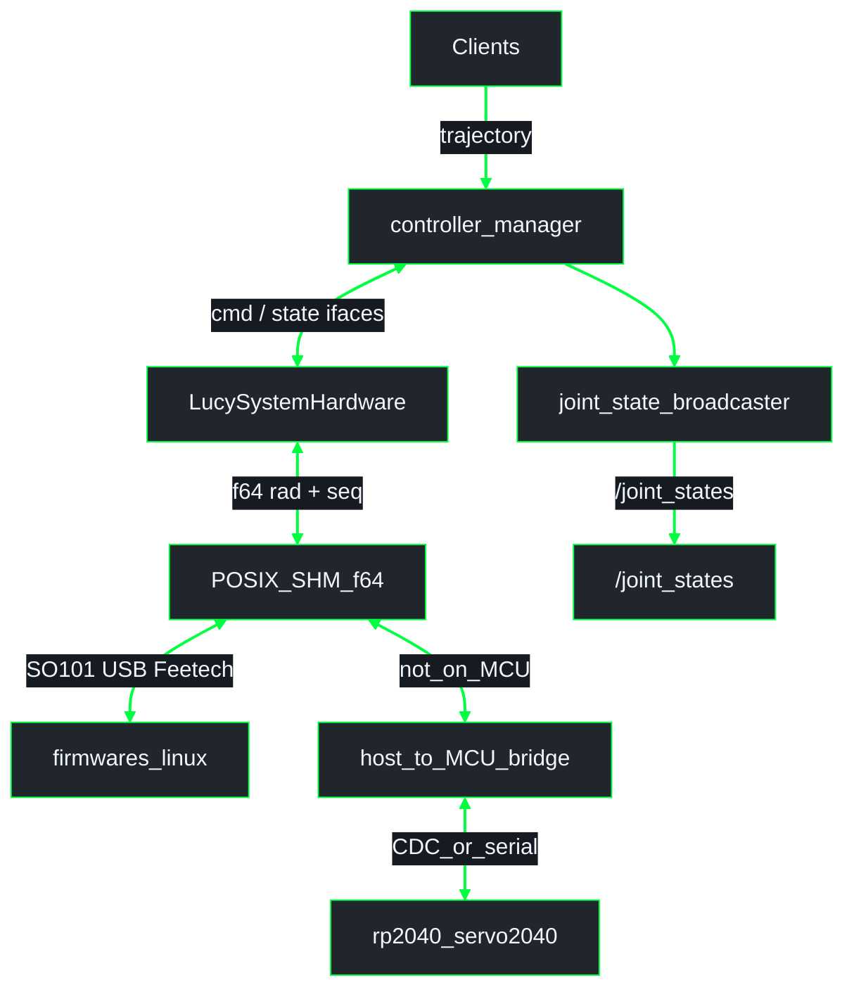

# ros2_control on Lucy (`lucy_ros_packages` + robot URDF)

ROS 2 **Jazzy**. Hardware plugin, f64 SHM contract, YAML, and launch. URDF / xacro blocks live in the active robot package (`thais_urdf` / `inmoov_urdf` / `so_arm101_urdf`); plugin binary in **`lucy_ros2_control`**.

**Related:**
- Pipeline / SHM: [`architecture/pipeline_shm.md`](architecture/pipeline_shm.md)
- Firmware paths: [`../../lucy_embedded_firmware/docs/architecture/firmware.md`](../../lucy_embedded_firmware/docs/architecture/firmware.md)
- Workspace overview: [`../../lucy_control_panel/docs/architecture/overview.md`](../../lucy_control_panel/docs/architecture/overview.md)
- [`DEVELOPER.md`](DEVELOPER.md)

---

## 1. What is ros2_control ?

Layer between high-level motion and hardware (or sim): controller manager, controllers, broadcasters, and a hardware interface plugin (`read()` / `write()`).

Clients talk to **controllers**, not microcontrollers. On Lucy, the plugin writes **`f64` radians** into POSIX SHM (`ActuatorSharedState` / `JointTable`). Host consumers (`firmwares/linux` for USB Feetech, or a host↔MCU bridge into Servo2040) read that SHM. The MCU does **not** mmap host SHM.

---

## 2. Lucy: components and packages

| Asset | Package | Notes |
|--------|---------|--------|
| **`LucySystemHardware`** | `lucy_ros2_control` | SHM writer for real hardware (`f64` rad + seq). |
| **`SharedMemoryChannel` / `ActuatorSharedState`** | `lucy_ros2_control` | HI ↔ host consumers layout. |
| **`firmwares/linux`** | `lucy_embedded_firmware` | Host USB Feetech consumer of f64 SHM (SO-ARM101). |
| **`rp2040_servo2040`** | `lucy_embedded_firmware` | InMoov + SO-ARM101 UART Feetech / PWM / I2C via host↔MCU bridge. |
| Controllers YAML / xacro | robot package | From `lucy_config_generator` / pipeline. |

---

## 3. Data flow

No micro-ROS; no `/actuators/*` command topics for actuation. Detail in [`architecture/pipeline_shm.md`](architecture/pipeline_shm.md).

`joint_state_broadcaster` is a **controller** under `controller_manager` (not a child of the HI). It publishes `/joint_states` from HI **state interfaces**.

- **`/joint_states`**: from **`joint_state_broadcaster`** (reads HI state interfaces via CM).
- **SHM:** `/{node_name}` segment; `hw_commands[]` / `hw_positions[]` as **radians**; `command_seq` / `state_seq` / `heartbeat`.
- **YAML:** angles in **radians** (degrees only at LCP UI).

---

## 4. Hardware plugin behavior (`LucySystemHardware`)

| `use_gazebo_sim` | `use_mock_hardware` | Plugin | `publish_actuators` |
|------------------|---------------------|--------|---------------------|
| `false` | `false` | `lucy_ros2_control/LucySystemHardware` | `true` (optional debug topic) |
| `false` | `true`  | `lucy_ros2_control/LucySystemHardware` | `false` |
| `true`  | *any*   | `gz_ros2_control/GazeboSimSystem` | n/a |

- `node_name` must match the SHM segment consumers use.
- `write()`: URDF clamp → joint→servo mapping as needed → write `hw_commands[]` radians and bump `command_seq`.

> **Gazebo caveat.** Upstream `gz_ros2_control` (jazzy) may not apply `<command_interface>` min/max inside `write()`.

---

## 5. Launch entry points

| Launch | Notes |
|--------|-------|
| `ros2 launch lucy_bringup lucy.launch.py` | Web API + control; real hardware attaches SHM consumers |
| `ros2 launch <robot_package> control.launch.py` | Minimal control stack |
| Gazebo launches | Sim plugins |

---

## 6. Web control panel

Needs active controllers, `ros2_control_node` with `LucySystemHardware` (or Gazebo), and the selected SHM consumer (`firmwares/linux` and/or host↔MCU bridge).

---

## 7. Operational pitfalls

1. Controllers inactive — `ros2 control list_controllers`.
2. Sim URDF on hardware — `use_gazebo_sim:=false`.
3. SHM `node_name` mismatch between HI and consumers.
4. **Encoding:** radians in YAML, HI, and SHM (`f64`). Driver edges map to Feetech ticks / PWM pulse.
5. Run GENERATE so URDF min/max land in xacro.
6. SO-ARM101: host `firmwares/linux` vs Servo2040 UART — pick matching board profile.
7. Agree `MAX_ACTUATORS` / `JointTable<N>` between HI and firmware consumers.

---

## 8. File index

| Path | Purpose |
|------|---------|
| `lucy_ros2_control/src/lucy_system.cpp` | HI plugin |
| `lucy_ros2_control/src/include/shared_memory_channel.hpp` | f64 SHM layout |
| Generator templates | xacro / board YAML / controllers |
| `lucy_embedded_firmware/` | RP2040 Servo2040 + host Feetech |

---

## 9. Config pipeline

VALIDATE → GENERATE (always) → optional BUILD/FLASH → RELOAD. See [`architecture/pipeline_shm.md`](architecture/pipeline_shm.md).
