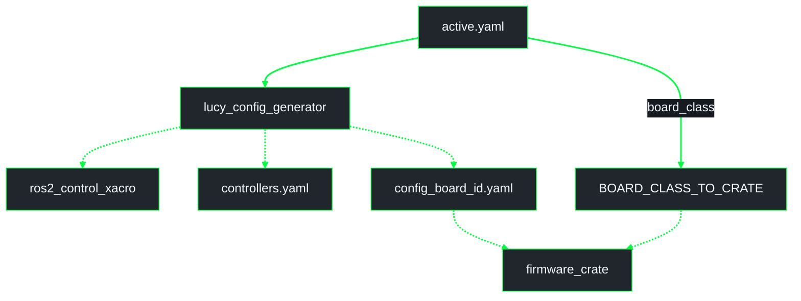
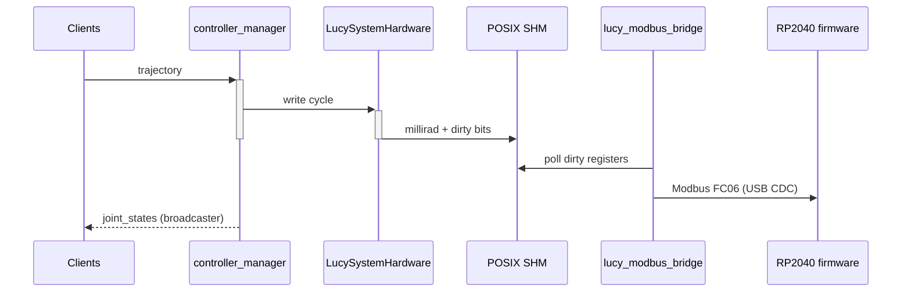
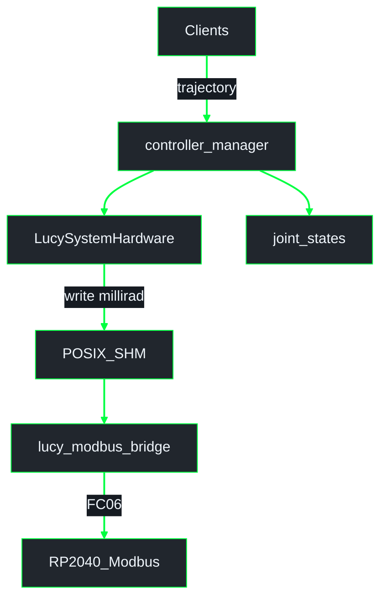

# Config pipeline and SHM / Modbus

Package-level detail for **`lucy_ros_packages`**.  
**System schematic:** [`lucy_ws/docs/architecture/overview.md`](../../../../docs/architecture/overview.md)  
**Index:** [`lucy_ws/docs/architecture/README.md`](../../../../docs/architecture/README.md)  
**Conventions:** [`lucy_ws/docs/architecture/GUIDE.md`](../../../../docs/architecture/GUIDE.md)

## Pipeline phases

**UML Activity (config pipeline)** - VALIDATE through RELOAD.

| Phase | Always? | Output |
|-------|---------|--------|
| VALIDATE | yes | schema + URDF cross-check |
| GENERATE | yes (incl. sim-only) | ros2_control xacro, `controllers.yaml`, per-board firmware YAML |
| BUILD | skipped in sim-only | UF2 per selected board crate |
| FLASH | skipped in sim-only / build_only | `picotool load` by `serial_id` |
| RELOAD | yes | restart control so URDF + controllers reload |

Toolchain readiness (`pixi run firmware-setup`) gates ACTIVATE / BUILD / FLASH.

## Generator outputs

**UML Component (generator)** - `active.yaml` to ROS and firmware artifacts.

| `board_class` | Firmware crate |
|---------------|----------------|
| `internal_servo_only` | `firmwares/rp2040_servo2040` |
| `internal_servo_i2c_pwm` | `firmwares/rp2040_servo2040` |
| `bus_servo_only` | `firmwares/rp2040_servo2040` |

## Host ↔ MCU (real robot)

**UML Sequence (actuation)** - trajectory clients to RP2040 Modbus.

**UML Component (actuation path)** - same path as boxes.

Actuation does **not** depend on JointState debug topics. `/joint_states`
comes from `joint_state_broadcaster` for TF / RViz.

## Related

- Workspace overview: [`lucy_ws/docs/architecture/overview.md`](../../../../docs/architecture/overview.md)
- Architecture guide: [`lucy_ws/docs/architecture/GUIDE.md`](../../../../docs/architecture/GUIDE.md)
- Package README: [`lucy_config_pipeline/README.md`](../../lucy_config_pipeline/README.md)
- Generator README: [`lucy_config_generator/README.md`](../../lucy_config_generator/README.md)
