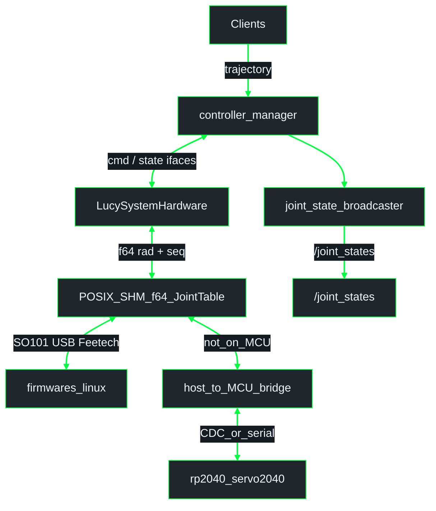

# Config pipeline and SHM

Package-level detail for **`lucy_ros_packages`**.

**Workspace overview (under `lucy_ws/src/`):**  
[`lucy_control_panel/docs/architecture/overview.md`](../../../lucy_control_panel/docs/architecture/overview.md)  
**Firmware paths:** [`lucy_embedded_firmware/docs/architecture/firmware.md`](../../../lucy_embedded_firmware/docs/architecture/firmware.md)  
**Index:** [README.md](README.md)

## Pipeline phases


| Phase | Always? | Output |
|-------|---------|--------|
| VALIDATE | yes | schema + URDF cross-check |
| GENERATE | yes (incl. sim-only) | ros2_control xacro, `controllers.yaml`, per-board firmware YAML |
| BUILD | skipped in sim-only | UF2 for Servo2040 and/or host `firmwares/linux` when that package exists |
| FLASH | skipped in sim-only / build_only | `picotool load` by `serial_id` (RP2040 only) |
| RELOAD | yes | restart control so URDF + controllers reload |

## Generator outputs

| `board_class` | Firmware crate |
|---------------|----------------|
| `internal_servo_only` | `firmwares/rp2040_servo2040` |
| `internal_servo_i2c_pwm` | `firmwares/rp2040_servo2040` |
| `bus_servo_only` | `firmwares/rp2040_servo2040` (`HAS_BUS` → UART0 Feetech) |

All Servo2040 profiles share one board crate; banks gate on YAML/`GENERATED_HAS_*`.

## End-to-end path (f64 SHM)

`joint_state_broadcaster` is a **controller** under `controller_manager` (not a child of the HI). It publishes `/joint_states` from HI **state interfaces**; the HI does not publish that topic.



```text
ActuatorSharedState / JointTable  (alignas 64; N = MAX_ACTUATORS or const N)
  command_seq:            atomic u64
  hw_commands[N]:         f64 / double   // radians
  hw_velocities[N]:       f64 / double
  hw_accelerations[N]:    f64 / double
  hw_torque_enabled[N]:   f64 / double
  state_seq:              atomic u64
  hw_positions[N]:        f64 / double   // radians
  heartbeat:              atomic u64
```

| Item | Notes |
|------|--------|
| Segment | `/{node_name}` (sanitised HI `node_name`) |
| Angle encoding | **`f64` radians** in SHM; YAML / HI joint space also radians |
| Host Feetech | `firmwares/linux` mmaps SHM → USB serial STS (SO-ARM101) |
| Servo2040 | Host↔MCU bridge carries commands; **UF2 never mmaps POSIX SHM** |
| ABI | Nested Rust `JointTable<N>` vs flat C++ `ActuatorSharedState` — agree `N` |

## Related

- Control-panel overview: [`../../../lucy_control_panel/docs/architecture/overview.md`](../../../lucy_control_panel/docs/architecture/overview.md)
- Firmware: [`../../../lucy_embedded_firmware/docs/architecture/firmware.md`](../../../lucy_embedded_firmware/docs/architecture/firmware.md)
- Package README: [`../../lucy_config_pipeline/README.md`](../../lucy_config_pipeline/README.md)
- Generator README: [`../../lucy_config_generator/README.md`](../../lucy_config_generator/README.md)
