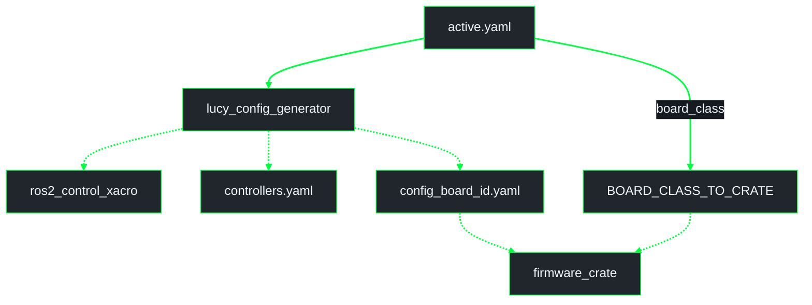
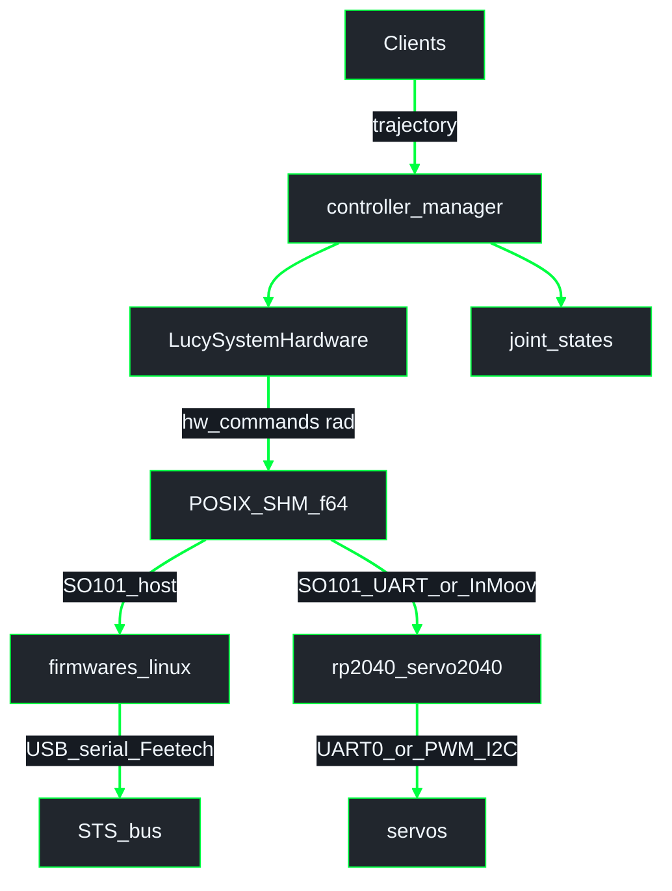

# Config pipeline and SHM (HI f64)

Package-level detail for **`lucy_ros_packages`**.  
**System schematic:** [`lucy_ws/docs/architecture/overview.md`](../../../../docs/architecture/overview.md)  
**Index:** [`lucy_ws/docs/architecture/README.md`](../../../../docs/architecture/README.md)  
**Conventions:** [`lucy_ws/docs/architecture/GUIDE.md`](../../../../docs/architecture/GUIDE.md)

## Pipeline phases

**UML Activity (config pipeline)** - VALIDATE through RELOAD.


| Phase | Always? | Output |
|-------|---------|--------|
| VALIDATE | yes | schema + URDF cross-check |
| GENERATE | yes (incl. sim-only) | ros2_control xacro, `controllers.yaml`, per-board firmware YAML |
| BUILD | skipped in sim-only | UF2 (Servo2040) and/or host linux Feetech process per selected path |
| FLASH | skipped in sim-only / build_only | `picotool load` by `serial_id` (RP2040 path only) |
| RELOAD | yes | restart control so URDF + controllers reload |

Toolchain readiness (`pixi run firmware-setup`) gates ACTIVATE / BUILD / FLASH for RP2040.

## Generator outputs

**UML Component (generator)** - `active.yaml` to ROS and firmware artifacts.



| `board_class` | Firmware crate (Servo2040 path) |
|---------------|----------------------------------|
| `internal_servo_only` | `firmwares/rp2040_servo2040` |
| `internal_servo_i2c_pwm` | `firmwares/rp2040_servo2040` |
| `bus_servo_only` | `firmwares/rp2040_servo2040` (`HAS_BUS` → UART0 Feetech) |

SO-ARM101 may instead run **`firmwares/linux`** (host USB serial Feetech) against the same SHM segment — selected by package / bringup, not by deleting the Servo2040 bus profile.

## Shared SHM contract (HI f64 arrays)

Architecture target for `LucySystemHardware` ↔ firmware consumers. Layout mirrors
[#63](https://github.com/Lucy-Robotics/lucy_ros_packages/pull/63) `ActuatorSharedState`
and firmware `JointTable` on `mbo/feat-protocol`:

```text
ActuatorSharedState / JointTable  (alignas 64)
  command_seq:            atomic u64
  hw_commands[N]:         f64 / double   // radians
  hw_velocities[N]:       f64 / double
  hw_accelerations[N]:    f64 / double
  hw_torque_enabled[N]:   f64 / double
  state_seq:              atomic u64
  hw_positions[N]:        f64 / double   // radians
  heartbeat:              atomic u64
```

- Segment name: `/{node_name}` (HI `node_name` param).
- Units: **radians only** in SHM (no millirad encoding).
- Consumers: `firmwares/linux` (USB Feetech) and/or RP2040 Servo2040 path (UART Feetech / PWM / I2C) once wired to this layout.
- Alignment work matches this struct on our tips; **do not** hard-rebase onto unfinished `mbo/feat-protocol` WIP.

### Transitional Modbus register path

Some current tips still use dirty-bit `u16` millirad registers + `lucy_modbus_bridge` → Modbus FC06 over USB CDC. Treat as temporary until the f64 `JointTable` path is end-to-end for Servo2040. Docs and new code should prefer the HI array contract above.

## Host ↔ actuators (real robot)

**UML Component (dual SO-ARM101 + InMoov)** - HI writes f64 SHM; consumers diverge by robot.



| Robot | Downstream of SHM |
|-------|-------------------|
| SO-ARM101 | Host `firmwares/linux` **or** Servo2040 **UART0** Feetech (`bus_servo_only`) |
| InMoov | Servo2040 PWM / I2C PCA9685 / ADC only |

Actuation does **not** depend on JointState debug topics. `/joint_states`
comes from `joint_state_broadcaster` for TF / RViz.

## Related

- Workspace overview: [`lucy_ws/docs/architecture/overview.md`](../../../../docs/architecture/overview.md)
- Architecture guide: [`lucy_ws/docs/architecture/GUIDE.md`](../../../../docs/architecture/GUIDE.md)
- Firmware paths: [`lucy_embedded_firmware/docs/architecture/firmware.md`](../../../../lucy_embedded_firmware/docs/architecture/firmware.md)
- Package README: [`lucy_config_pipeline/README.md`](../../lucy_config_pipeline/README.md)
- Generator README: [`lucy_config_generator/README.md`](../../lucy_config_generator/README.md)
