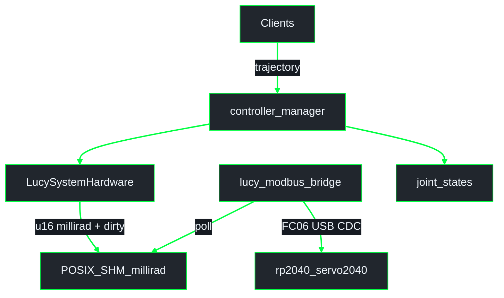

# Config pipeline and SHM

Package-level detail for **`lucy_ros_packages`**.

**Workspace overview (under `lucy_ws/src/`):**  
[`lucy_control_panel/docs/architecture/overview.md`](../../../lucy_control_panel/docs/architecture/overview.md)  
**Firmware paths:** [`lucy_embedded_firmware/docs/architecture/firmware.md`](../../../lucy_embedded_firmware/docs/architecture/firmware.md)  
**Index:** [README.md](README.md)

> **Branch note.** Architecture text here describes **(A)** the working Modbus millirad tip (`cma/pipeline-flash` + firmware `cma/fw-boards`) and **(B)** the WIP HI f64 contract (`mbo/feat-rust-middleware` [#63](https://github.com/Lucy-Robotics/lucy_ros_packages/pull/63), firmware `mbo/feat-protocol`). This docs branch may not contain every package named below.

## Pipeline phases


| Phase | Always? | Output |
|-------|---------|--------|
| VALIDATE | yes | schema + URDF cross-check |
| GENERATE | yes (incl. sim-only) | ros2_control xacro, `controllers.yaml`, per-board firmware YAML |
| BUILD | skipped in sim-only | UF2 for Servo2040 (and/or host linux Feetech when that package exists) |
| FLASH | skipped in sim-only / build_only | `picotool load` by `serial_id` (RP2040 only) |
| RELOAD | yes | restart control so URDF + controllers reload |

## Generator outputs

| `board_class` | Firmware crate (Servo2040 unification tip) |
|---------------|---------------------------------------------|
| `internal_servo_only` | `firmwares/rp2040_servo2040` |
| `internal_servo_i2c_pwm` | `firmwares/rp2040_servo2040` |
| `bus_servo_only` | `firmwares/rp2040_servo2040` (`HAS_BUS` → UART0 Feetech) |

Older tips may still map `bus_servo_only` → `firmwares/rp2040_bus_servo` (removed on current firmware tip). Use the ros + firmware tips that agree on `rp2040_servo2040`.

## A. Current end-to-end path (Modbus millirad)

**Source of truth for operators today:** ros `cma/pipeline-flash` + firmware `cma/fw-boards`.



| Item | Value |
|------|--------|
| SHM objects | `/{sanitised_node}.lucy_reg_table`, `/{sanitised_node}.lucy_reg_header`, semaphore `/{sanitised_node}` |
| Angle encoding | milliradians (`rad × 1000`) in holding registers |
| MCU link | Modbus RTU over USB CDC — **MCU does not mmap host SHM** |
| SO-ARM101 | Servo2040 UART0 Feetech behind that Modbus path (`bus_servo_only`) |
| InMoov | Servo2040 PWM / I2C / ADC profiles behind the same Modbus path |

YAML angles remain **radians**; only the Modbus SHM register table uses millirad.

## B. Target HI f64 contract (WIP — not shipped on this PR)

Align with [#63](https://github.com/Lucy-Robotics/lucy_ros_packages/pull/63) / `mbo/feat-protocol` without rebasing onto unfinished WIP:

```text
ActuatorSharedState / JointTable  (alignas 64; N = MAX_ACTUATORS or const N)
  command_seq:            atomic u64
  hw_commands[N]:         f64 / double   // radians
  hw_velocities[N]:       f64 / double
  hw_accelerations[N]:    f64 / double
  hw_torque_enabled[N]:   f64 / double
  state_seq:              atomic u64
  hw_positions[N]:        f64 / double   // radians
  heartbeat:              atomic u64
```

| Item | Notes |
|------|--------|
| Segment (f64 tip) | `/{node_name}` |
| Host Feetech | `firmwares/linux` mmaps SHM → USB serial STS (SO-ARM101 alternate) — WIP |
| Servo2040 | Still needs a **host↔MCU** path (today Modbus); never claim the UF2 mmaps POSIX SHM |
| ABI | Nested Rust `JointTable<N>` vs flat C++ `ActuatorSharedState`; `JointTable<6>` ≠ N=32 overlay |

## Related

- Control-panel overview: [`../../../lucy_control_panel/docs/architecture/overview.md`](../../../lucy_control_panel/docs/architecture/overview.md)
- Firmware: [`../../../lucy_embedded_firmware/docs/architecture/firmware.md`](../../../lucy_embedded_firmware/docs/architecture/firmware.md)
- Package README: [`../../lucy_config_pipeline/README.md`](../../lucy_config_pipeline/README.md)
- Generator README: [`../../lucy_config_generator/README.md`](../../lucy_config_generator/README.md)
